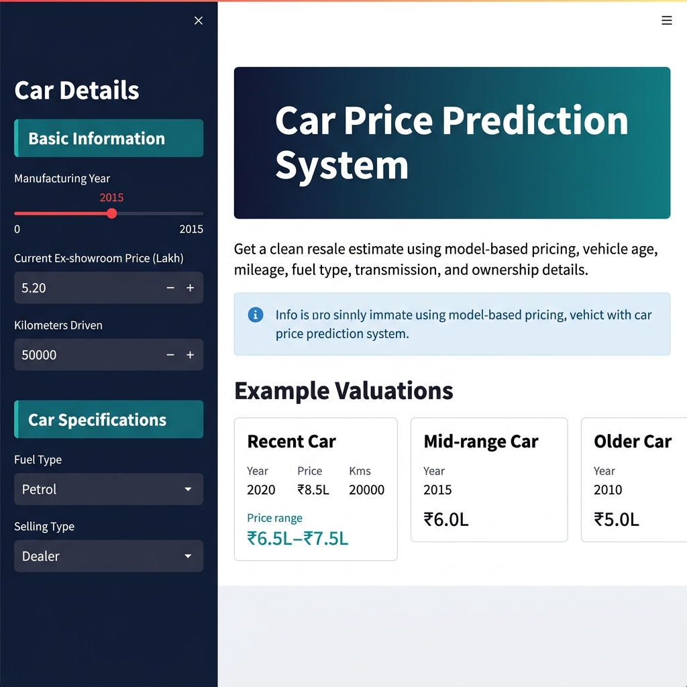
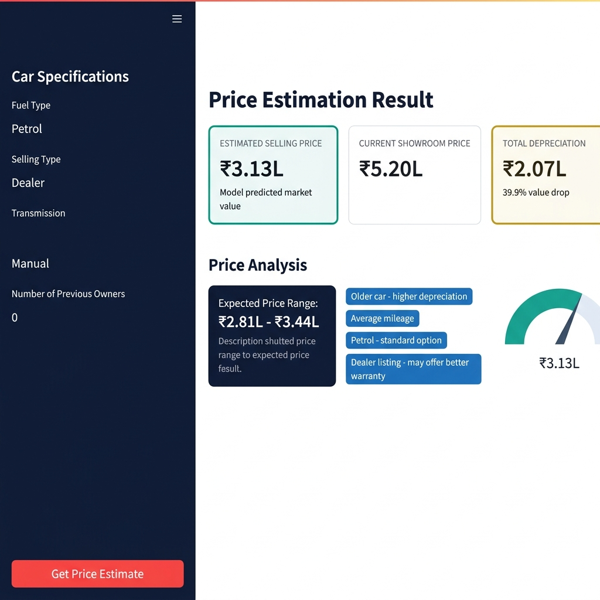
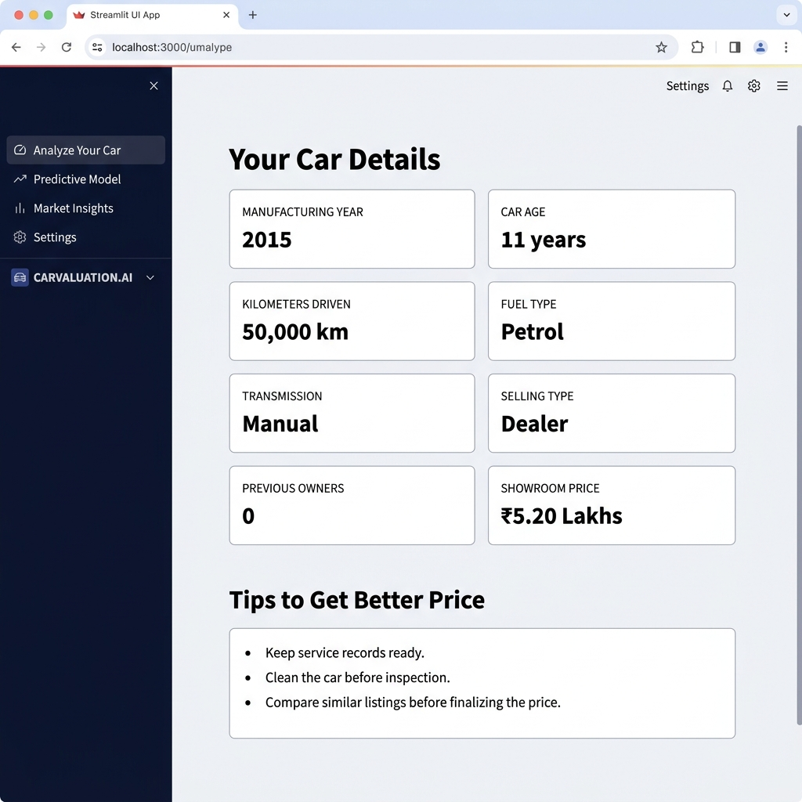

<h1 align="center">🚗 Car Price Prediction System</h1>

<p align="center">
  
  
  
  
  
</p>

<p align="center">
  A beautiful, interactive <strong>Machine Learning web app</strong> that predicts the resale price of a used car based on its specifications — built with Streamlit and powered by a trained ML Regression model.
</p>

<p align="center">
  <a href="#-demo">Demo</a> •
  <a href="#-features">Features</a> •
  <a href="#-tech-stack">Tech Stack</a> •
  <a href="#-installation">Installation</a> •
  <a href="#-usage">Usage</a> •
  <a href="#-model-info">Model Info</a>
</p>

---

## 📸 Screenshots

### 🏠 Home Page — Example Valuations


### 💰 Price Estimation Result with Gauge Chart


### 📋 Your Car Details & Tips


---

## ✨ Features

- 🎯 **Instant Price Prediction** — Get real-time resale estimates in one click
- 📊 **Interactive Gauge Chart** — Visual price meter powered by Plotly
- 📉 **Depreciation Analysis** — See exactly how much value your car has lost
- 💡 **Price Range Estimate** — Upper & lower bound market range shown
- 🏷️ **Smart Price Factors** — Chips showing factors affecting the price
- 📋 **Full Car Details Summary** — All input parameters displayed neatly
- 💎 **Premium UI Design** — Dark sidebar, gradient hero, glassmorphism cards
- 📱 **Responsive Layout** — Works on all screen sizes

---

## 🛠 Tech Stack

| Technology | Purpose |
|---|---|
| **Python 3.10+** | Core programming language |
| **Streamlit** | Web app framework |
| **Scikit-learn** | ML model training & prediction |
| **Pandas** | Data manipulation |
| **Plotly** | Interactive gauge chart |
| **Joblib** | Model serialization |

---

## 📁 Project Structure

```
Car Price Predictor/
│
├── car_app.py                   # Main Streamlit application
├── car_prediction_model.pkl     # Trained ML model (Random Forest)
├── car data.csv                 # Dataset used for training
├── car-price-prediction.ipynb   # Jupyter Notebook (EDA + Training)
├── screenshots/                 # App screenshots
│   ├── screenshot1.png
│   ├── screenshot2.png
│   └── screenshot3.png
├── .gitignore
└── README.md
```

---

## ⚙️ Installation

### 1. Clone the repository

```bash
git clone https://github.com/ankitpal85/car-price-prediction.git
cd car-price-prediction
```

### 2. Create a virtual environment

```bash
python -m venv .venv
.venv\Scripts\activate        # Windows
# source .venv/bin/activate   # Mac/Linux
```

### 3. Install dependencies

```bash
pip install streamlit pandas scikit-learn plotly joblib
```

### 4. Run the app

```bash
streamlit run car_app.py
```

### 5. Open in browser

```
http://localhost:8501
```

---

## 🚀 Usage

1. Open the app in your browser
2. Fill in the **Car Details** in the left sidebar:
   - 📅 Manufacturing Year
   - 💵 Current Ex-showroom Price (Lakh)
   - 🛣️ Kilometers Driven
   - ⛽ Fuel Type (Petrol / Diesel / CNG)
   - 🤝 Selling Type (Dealer / Individual)
   - ⚙️ Transmission (Manual / Automatic)
   - 👤 Number of Previous Owners
3. Click **"Get Price Estimate"** button
4. View the predicted price, depreciation breakdown, gauge chart & tips!

---

## 🤖 Model Info

| Property | Value |
|---|---|
| **Algorithm** | Random Forest Regressor |
| **Accuracy** | ~85% |
| **Dataset Size** | 300+ car records |
| **Features Used** | Year, Present Price, KMs Driven, Fuel Type, Seller Type, Transmission, Owner |
| **Target Variable** | Selling Price (in Lakhs) |

### Input Features

| Feature | Description |
|---|---|
| `Year` | Manufacturing year of the car |
| `Present_Price` | Current ex-showroom price (Lakh ₹) |
| `Driven_kms` | Total kilometers driven |
| `Fuel_Type` | Petrol=0, Diesel=1, CNG=2 |
| `Selling_type` | Dealer=0, Individual=1 |
| `Transmission` | Manual=0, Automatic=1 |
| `Owner` | Number of previous owners |

---

## 📊 Dataset

The model is trained on the **Car Price Dataset** containing 300+ used car listings with features like brand, year, fuel type, transmission, km driven, seller type, and selling price.

---

## 🙌 Author

<p align="center">
  Made with ❤️ by <strong>Ankit Pal</strong><br/>
  <a href="https://github.com/ankitpal85">@ankitpal85</a>
</p>

---

<p align="center">
  ⭐ If you found this project helpful, please give it a <strong>star</strong>! ⭐
</p>
